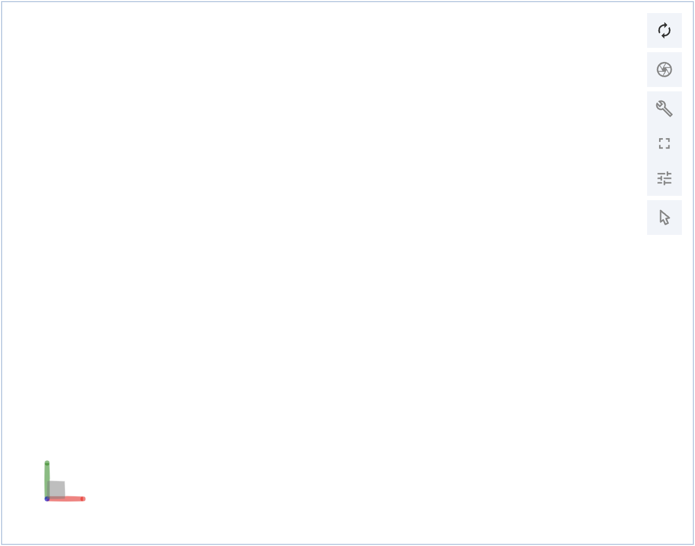

```{toctree}
:maxdepth: 2

   load
   parameters
   helper
   callbacks
   representations
```

# Load the plugin

## Default settings

The easiest way to load the plugin is to use the default settings. Only specify an `id` and the size value for the plugin:

```python
import dash_molstar
from dash import Dash, html

app = Dash(__name__)
app.layout = html.Div(
    dash_molstar.MolstarViewer(
        id='viewer', style={'width': '500px', 'height':'500px'}
    ),
)
```

This will generate a simpliest viewer object on your webpage. The viewer contains some basic controls:

{width=500px align=center}

The user can toggle the full control panel by clicking the buttons.

Usually, if you use bootstrap to design you page, you can leave the `width` as `auto`. Then specify a width for the column, the molstar viewer will automatically resize in response to the change of page size:

```python
import dash_molstar
from dash import Dash, html
import dash_bootstrap_components as dbc

app = Dash(__name__)
app.layout = dbc.Container([
    dbc.Row([
        dbc.Col([
            dash_molstar.MolstarViewer(
                id='viewer', style={'width': 'auto', 'height':'500px'}
            )
        ], width=6),
    ])
])
```

## Customize the layout
`layout` is the initial appearance of molstar viewer. It has some default settings. If you wish to specify some of the options, indicate them with a `dict`. 

```py
import dash_molstar
from dash import Dash, html

app = Dash(__name__)
app.layout = html.Div(
    dash_molstar.MolstarViewer(
        id='viewer', style={'width': '500px', 'height': '500px'},
        layout={'layoutShowControls': True, 'layoutIsExpanded': True}
    ),
)
```

### General options

The general options are used to control the look of the viewer object, including whether to show some control panels or buttons. The avaliable options are listed as follows. If the keys are not specified in `layout` parameter, the default value will be applied.

| Keys | Optional Values | Default Value |
| --- | --- | --- |
|"showImportControls"|True, False|False|
|"showSessionControls"|True, False|True|
|"showStructureSourceControls"|True, False|True|
|"showMeasurementsControls"|True, False|True|
|"showStrucmotifSubmitControls"|True, False|True|
|"showSuperpositionControls"|True, False|True|
|"showQuickStylesControls"|True, False|True|
|"showStructureComponentControls"|True, False|True|
|"showVolumeStreamingControls"|True, False|False|
|"showAssemblySymmetryControls"|True, False|False|
|"showValidationReportControls"|True, False|False|
|"showPredictedAlignedErrorPlot"|True, False|True|
|"showMembraneOrientationPreset"|True, False|False|
|"showNakbColorTheme"|True, False|False|
|"detachedFromSierra"|True, False|False|
|"layoutIsExpanded"|True, False|False|
|"layoutShowControls"|True, False|False|
|"layoutControlsDisplay"|'outside', 'portrait', 'landscape' and 'reactive'|'reactive'|
|"layoutShowSequence"|True, False|True|
|"layoutShowLog"|True, False|False|
|"viewportShowExpand"|True, False|True|
|"viewportShowSelectionMode"|True, False|True|
|"backgroundColor"|Colors|white|
|"manualReset"|True, False|False|
|"pickingAlphaThreshold"|float|0.5|
|"showWelcomeToast"|True, False|False|

:::{note}
The layout of viewer should not be changed via callbacks.
:::

### Customize the canvas
Besides the general controls listed above, you are allowed to customize the canvas (where the molecule were shown) settings. To specify the canvas options, put them in a dict as the value of the key `canvas3d` in `layout`.

```py
from dash_molstar.utils.representations import Representation
import dash_molstar

canvas = {
    'camera': {
        'mode': 'perspective'
    },
    'postprocessing': {
        'shadow': Representation.np('on', {
            'steps': 1,
            'maxDistance': 3,
            'tolerance': 1
        })
    }
}

dash_molstar.MolstarViewer(
    id='viewer', style={'width': '500px', 'height': '500px'},
    layout={'canvas3d': canvas}
)
```

:::{seealso}
NamedParams is a molstar defined data type. See how to generate a correct NamedParams, in the [NamedParams](#NamedParams) section.
:::

The customizable keys and their corresponding values are listed as follows.

- **camera** (dict) – Settings for camera configuration.
    - *mode* ("perspective" | "orthographic") – Camera mode type.
    - *helper* (dict) – Contains helper settings.
        - *axes* (any) – Configures the camera’s axes settings.
    - *stereo* (NamedParams) – Settings for stereo mode.
        - *off* (None as NamedParams) – Stereo mode is disabled.
        - *on* (dict as NamedParams) – Stereo mode is enabled with additional properties:
            - *eyeSeparation* (any) – Separation distance for stereo effect.
            - *focus* (any) – Focus distance for stereo effect.
    - *fov* (int) – Field of view for the camera. (Ranging from 10 to 130)
    - *manualReset* (boolean) – Enables manual camera reset.

- **cameraFog** (NamedParams) – Fog settings for the camera.
    - *off* (None as NamedParams) – Fog is disabled.
    - *on* (dict as NamedParams) – Fog is enabled with the following properties:
        - *intensity* (int) – Intensity of the fog. (Ranging from 1 to 100)

- **cameraClipping** (dict) – Settings for camera clipping.
    - *radius* (int) – Radius for clipping. (Ranging from 0 to 99)
    - *far* (boolean) – Enables far clipping.
    - *minNear* (float) – Minimum distance for near clipping. (Ranging from 0.1 to 100)

- **viewport** (NamedParams) – Viewport configuration options.
    - *canvas* (None as NamedParams) – Uses the canvas viewport.
    - *static-frame* (dict as NamedParams) – Static frame configuration.
        - *x*, *y*, *width*, *height* (float) – Position and size of the static frame.
    - *relative-frame* (dict as NamedParams) – Relative frame configuration.
        - *x*, *y*, *width*, *height* (float) – Position and size of the relative frame.

- **cameraResetDurationMs** (int) – Duration for camera reset in milliseconds.
- **sceneRadiusFactor** (float) – Scaling factor for scene radius.
- **transparentBackground** (boolean) – Enables transparent background.
- **dpoitIterations** (int) – Number of depth-peeling iterations.
- **multiSample** (dict) – Multi-sampling configuration.
    - *mode* (string) – Multi-sampling mode. (Available values are "On", "Off" and "Temporal")
    - *sampleLevel* (int) – Level of sampling. (Ranging from 0 to 5)

- **postprocessing** (dict) – Post-processing effects.
    - *occlusion* (NamedParams) – Ambient occlusion settings.
        - *off* (None as NamedParams) – Occlusion effect disabled.
        - *on* (dict as NamedParams) – Occlusion enabled with properties:
            - *samples* (int) – Ranging from 1 to 256.
            - *radius* (float) – Ranging from 0 to 20.
            - *bias* (float) – Ranging from 0 to 3.
            - *blurKernelSize* (int) – Ranging from 1 to 25.
            - *blurDepthBias* (float) – Ranging from 0.1 to 1.
            - *resolutionScale* (int) – Ranging from 0.1 to 1.
            - *multiScale* (NamedParams)
                - *off* (None as NamedParams) – Multi scale disabled.
                - *on* (dict as NamedParams) – Unknown parameters.
            - *color* (Color) – Color entries in hex values.
            - *transparentThreshold* (float) – Ranging from 0.1 to 1.
    - *shadow* (NamedParams) – Shadow settings.
        - *off* (None as NamedParams) – Shadows disabled.
        - *on* (dict) – Shadows enabled with parameters:
            - *steps* (int) – Ranging from 1 to 64.
            - *maxDistance* (int) – Ranging from 0 to 256.
            - *tolerance* (float) – Ranging from 0 to 10.
    - *outline* (NamedParams) – Outline settings.
        - *off* (None as NamedParams) – Outline effect disabled.
        - *on* (dict) – Outline enabled with properties:
            - *scale* (int) – Ranging from 0 to 5.
            - *threshold* (float) – Ranging from 0.01 to 1.
            - *color* (Color) – Color entries in hex values.
            - *includeTransparent* (boolean)
    - *dof* (NamedParams) – dof settings.
        - *off* (None as NamedParams) – dof disabled.
        - *on* (dict) – dof enabled with properties:
            - *blurSize* (int) – Ranging from 1 to 32.
            - *blurSpread* (float) – Ranging from 0.01 to 10.
            - *inFocus* (int) – Ranging from -5000 to 5000.
            - *PPM* (float) – Ranging from 0 to 5000.
            - *center* (string)
            - *mode* (string)
    - *antialiasing* (NamedParams) – Antialiasing settings.
        - *off* (None as NamedParams) – Antialiasing disabled.
        - *smaa* (dict) – SMAA antialiasing with *edgeThreshold* and *maxSearchSteps* (any).
        - *fxaa* (dict) – FXAA antialiasing with properties:
            - *edgeThresholdMin*, *edgeThresholdMax*, *iterations*, *subpixelQuality* (any).
    - *background* (dict) – Background variant configuration.
        - *variant* (any) – Background variant settings.
    - *bloom* (NamedParams) – Background variant configuration.
        - *off* (None as NamedParams) – Blooming disabled.
        - *on* (dict) – Blooming enabled with properties:
            - *strength* (float) – Ranging from 0 to 3.
            - *radius* (float) – Ranging from 0 to 1.
            - *threshold* (int) – Unknown.
            - *mode* (string) – *Luminosity* or *Emissive*.

- **marking** (dict) – Marking settings.
    - *enabled* (boolean) – Enables marking.
    - *highlightEdgeColor*, *selectEdgeColor* (Color) – Colors for highlighting and selection edges.
    - *edgeScale*, *highlightEdgeStrength*, *selectEdgeStrength*, *ghostEdgeStrength*, *innerEdgeFactor* (number) – Edge settings.

- **renderer** (dict) – Renderer settings.
    - *backgroundColor*, *highlightColor*, *selectColor*, *dimColor*, *ambientColor* (Color) – Colors for different render states.
    - *pickingAlphaThreshold*, *interiorDarkening*, *interiorColorFlag*, *highlightStrength*, *selectStrength*, *dimStrength*, *markerPriority*, *xrayEdgeFalloff*, *ambientIntensity* (number) – Various rendering parameters.
    - *light* (array of dicts) – Light configuration with *inclination*, *azimuth*, *color*, and *intensity* (number).

- **trackball** (dict) – Trackball control settings.
    - *noScroll* (boolean) – Disables scroll interaction.
    - *rotateSpeed*, *zoomSpeed*, *panSpeed*, *dynamicDampingFactor*, *minDistance*, *maxDistance*, *gestureScaleFactor*, *maxWheelDelta* (number) – Trackball control settings.
    - *animate* (NamedParams) – Animation settings for trackball.
        - *off* – No animation.
        - *spin* – Spinning animation with *speed* (any).
        - *rock* – Rocking animation with *speed* and *angle* (any).
    - *bindings* (dict) – Binding settings for various drag and scroll actions.

- **interaction** (dict) – Interaction settings.
    - *maxFps* (number) – Maximum frames per second for interaction.
    - *preferAtomPixelPadding* (number) – Padding for atom pixels.

- **debug** (dict) – Debugging settings.
    - *sceneBoundingSpheres*, *visibleSceneBoundingSpheres*, *objectBoundingSpheres*, *instanceBoundingSpheres* (boolean) – Options for showing bounding spheres.

- **handle** (dict) – Handle settings.
    - *handle* (NamedParams) – Settings for handle visibility.
        - *off* – Handle disabled.
        - *on* (dict) – Handle enabled with properties:
            - *alpha*, *ignoreLight*, *colorX*, *colorY*, *colorZ*, *scale*, *doubleSided*, *flipSided*, *flatShaded*, *xrayShaded*, *transparentBackfaces*, *bumpFrequency*, *bumpAmplitude*, *quality*, *material*, *clip*, *instanceGranularity* (any).
